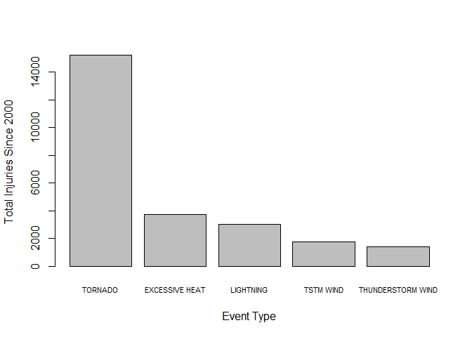
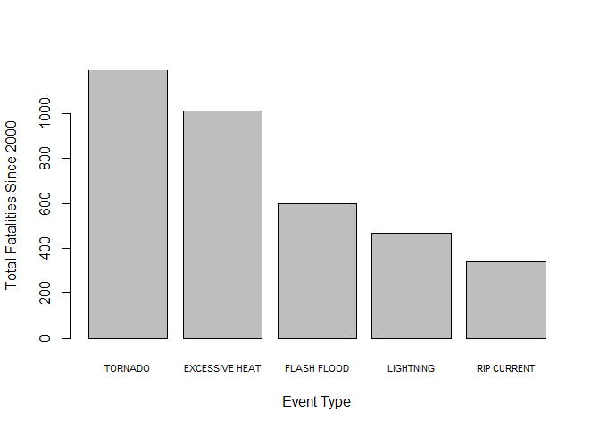
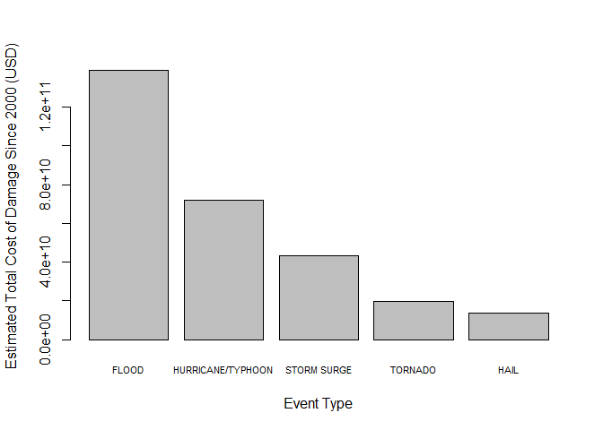

## Synopsis

Using data from the NOAA Storm Database, I determined which types of weather events have the most substantial health and economic effects.  To do this, I only used data from the years 2000 to the present, as these years had the most complete data and were the most relevant to the present time.  I added up the number of fatalities and injuries from each type of weather event during this time period to find the 5 types of events that caused the most fatalities and injuries.  To determine economic damage, I added up the combined cost of crop and property damage for each type of weather event and reported the 5 types of events that had the most economic impact.  

## Data Processing

First, I loaded all necessary R packages and downloaded the data:

```r
library(dplyr)
```

```
## Warning: package 'dplyr' was built under R version 4.2.2
```

```
## 
## Attaching package: 'dplyr'
```

```
## The following objects are masked from 'package:stats':
## 
##     filter, lag
```

```
## The following objects are masked from 'package:base':
## 
##     intersect, setdiff, setequal, union
```

```r
library(lubridate)
```

```
## Warning: package 'lubridate' was built under R version 4.2.2
```

```
## Loading required package: timechange
```

```
## Warning: package 'timechange' was built under R version 4.2.2
```

```
## 
## Attaching package: 'lubridate'
```

```
## The following objects are masked from 'package:base':
## 
##     date, intersect, setdiff, union
```

```r
dataurl = "https://d396qusza40orc.cloudfront.net/repdata%2Fdata%2FStormData.csv.bz2"
datadest = "stormdata.csv.bz2"
download.file(dataurl,datadest)
df <- read.csv(datadest)
```

Next, I filtered the data such that only data from years 2000 to the present were included.  This was done to ensure that the data presented was as relevant to the present as possible, and to use data from a time period where there was as complete information as possible.  


```r
# Use data from 2020 to present (more recent years are more complete and better answer the question)
df$BGN_DATE <- as.Date(df$BGN_DATE,format="%m/%d/%Y %H:%M:%S")
df <- df[df$BGN_DATE > as.Date('2000-01-01'),]
```

After filtering for relevant dates, I added up injuries and fatalities by event type:


```r
# Health effects over time
healtheffects <- as.data.frame(df %>% group_by(EVTYPE) %>% summarise(totalfatalities=sum(FATALITIES), .groups='drop'))
injuryeffects <- as.data.frame(df %>% group_by(EVTYPE) %>% summarise(totalinjuries=sum(INJURIES), .groups='drop'))
healtheffects <- healtheffects[order(-healtheffects$totalfatalities),]
injuryeffects <- injuryeffects[order(-injuryeffects$totalinjuries),]
healtheffects <- healtheffects[1:5,]
injuryeffects <- injuryeffects[1:5,]
```

Next, I calculated economic impact by adding up crop and property damage.  To do this, I had to convert the corresponding EXP fields to their corresponding multipliers ("K" to 1,000, "M" to 1,000,000, etc.) and multiply these by the property and crop damage fields.  I then added up total property and crop damage by event type.  


```r
# Economic effects over time
df$PROPDMGEXP[df$PROPDMGEXP == "K"] = "1000"
df$PROPDMGEXP[df$PROPDMGEXP == "M"] = "1000000"
df$PROPDMGEXP[df$PROPDMGEXP == "B"] = "1000000000"
df$PROPDMGEXP[df$PROPDMGEXP == ""] = "0"

df$CROPDMGEXP[df$CROPDMGEXP == "K"] = "1000"
df$CROPDMGEXP[df$CROPDMGEXP == "M"] = "1000000"
df$CROPDMGEXP[df$CROPDMGEXP == "B"] = "1000000000"
df$CROPDMGEXP[df$CROPDMGEXP == ""] = "0"

df$PROPDMG <- as.numeric(df$PROPDMGEXP)*df$PROPDMG
df$CROPDMG <- as.numeric(df$CROPDMGEXP)*df$CROPDMG
econeffects <- as.data.frame(df %>% group_by(EVTYPE) %>% summarise(totdamage=sum(CROPDMG) + sum(PROPDMG), .groups='drop'))
econeffects <- econeffects[order(-econeffects$totdamage),]
econeffects <- econeffects[1:5,]
```

## Results
The bar plot below shows the 5 weather events with the most injuries since 2000.  The events that caused the most injuries are tornadoes, excessive heat, lightning, tstm wind, and thunderstorm wind.  
<!-- -->
  
The bar plot below shows the 5 weather events with the most fatalities since 2000.  The events that caused the most fatalities are tornadoes, excessive heat, flash flooding, lightning, and rip currents.  
<!-- -->
  
The bar plot below shows the 5 weather events with the most economic impact since 2000.  The events that had the most economic impact are floods, hurricane/typhoons, storm surges, tornadoes, and hail.  
<!-- -->
  
Based on this analysis, the events that are most harmful to population health are tornadoes, excessive heat, flash flooding, lightning, rip currents, tstm wind, and thunderstorm wind.  The events that have the greatest economic consequences are floods, hurricane/typhoons, storm surges, tornadoes, and hail.  
